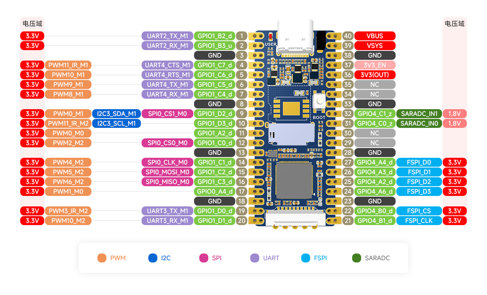
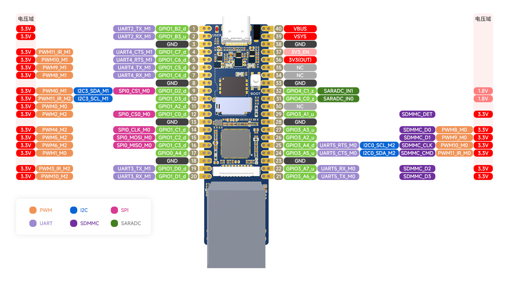
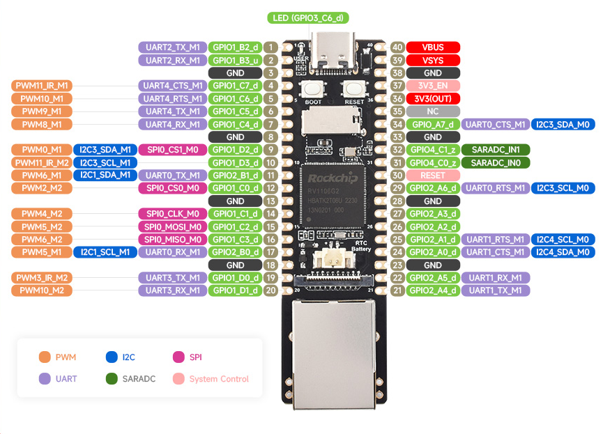

# 说明

本分支为个人修改版，原版代码请查看main分支。

原版说明如下：

- [readme_cn]( project/readme_cn.txt)
- [readme_en]( project/readme_en.txt)

官方WIKI：https://wiki.luckfox.com/zh/Luckfox-Pico/Luckfox-Pico-quick-start

## 编译

简易编译步骤如下：

- 配置目标（需要支持的主板）：

  ```bash
  ./build.sh lunch
  ```

  

- 编译：

  ```bash
  ./build.sh
  ```


编译过程中缺少什么就安装什么。

编译完成后镜像文件所在目录为output/image,可使用SocToolKit工具打开此目录进行烧录。

# 开发板

本仓库主要支持由[微雪电子](https://www.waveshare.net/)(代理[Luckfox](https://www.luckfox.com))出品的luckfox-pico开发板,也可用于其它RV1103/RV1106主控的固件开发（需自行适配）。

主要支持的开发板如下：

- LuckFox Pico
- LuckFox Pico Plus
- LuckFox Pico Pro/Max

## LuckFox Pico

### 硬件

Luckfox Pico是由[微雪电子](https://www.waveshare.net/)(代理[Luckfox](https://www.luckfox.com))出品的RV1103开发板，其具有64M RAM。采用SD卡启动。



### 固件

本仓库支持Luckfox Pico的板级配置如下：

-  BoardConfig_IPC/BoardConfig-EMMC-NONE-RV1103_Luckfox_Pico-IPC.mk


## LuckFox Pico Plus

### 硬件

Luckfox Pico Plus是由[微雪电子](https://www.waveshare.net/)(代理[Luckfox](https://www.luckfox.com))出品的RV1103开发板，其具有64M RAM及128M SPI-Nand。 




### 固件

本仓库支持Luckfox Pico Plus的板级配置如下：

-  BoardConfig_IPC/BoardConfig-SPI_NAND-NONE-RV1103_Luckfox_Pico_Plus-IPC.mk


## LuckFox Pico Pro/Max

### 硬件

Luckfox Pico Pro/Max是由[微雪电子](https://www.waveshare.net/)(代理[Luckfox](https://www.luckfox.com))出品的RV1106开发板，其具有256M SPI-Nand。

Luckfox Pico Pro具有128M RAM。Luckfox Pico Max具有256M RAM。



### 固件

本仓库支持Luckfox Pico Pro/Max的板级配置如下：

- BoardConfig_IPC/BoardConfig-SPI_NAND-NONE-RV1106_Luckfox_Pico_Max-IPC.mk


# 外设

在本仓库中外设主要指开发板的外设接口或者外设设备。详细的教程请访问官方wiki。

## 固定外设

固定外设主要指开发板上未使用引脚引出的外设，如采用专用接口的外设。在设计自己的PCB板时，应尽量避免改变固定外设的用途（在SDK开发过程中会参考固定外设的接口，厂家可能已经分配了用途。）。

### 按键

BOOT按键：用于进入maskrom模式。

RESET按键：用于复位。

### LED

通常用于指示运行状态。

### SD卡

通常用于接sd卡（或emmc）等存储设备。

理论上还可用于接sdio接口的外设设备（如wifi模块），需要自行适配驱动与设备树。

### CSI 摄像头

适配 SC3336 3MP Camera (A)  摄像头，这款摄像头采用思特威SC3336感光芯片，支持3百万像素。具备高灵敏度，高信噪比低照度的性能，能够呈现更加细腻、色彩更加逼真的夜视全彩成像，更好地适应环境光线变化。

### 以太网

用于连接以太网。

### SPI-NAND

SPI-NAND挂接在一个支持Quad-SPI的SPI接口，占用六个IO（不包括电源与地）。

### USB

默认情况下，USB工作在OTG模式，即RV1103/RV1106可作为Device设备，主要用于供电、固件烧录、USB调试（USB虚拟网卡、基于USB的adb等），也可作为Host设备（由USB的id引脚切换）。

理论上，USB口还可配置为Host模式或Device模式。

本人推崇使用usb作为外设扩展接口，其具有以下优点：

- 支持热插拔，无需在设备树中配置所挂接的子设备。
- 可使用hub扩展较多接口。
- 支持USB的转换芯片较多。

## 非固定外设

固定外设主要指开发板上使用引脚引出的外设。通常指所焊接排针的引脚，此类外设通常可通过设备树配置修改。

### GPIO

通用输入/输出是最简单的接口。

在Linux可通过sysfs访问GPIO,路径为/sys/class/gpio。

注意：只能使用引脚未被配置为其它非GPIO功能的引脚，否则可能无效或出现冲突。

### PWM

PWM，全称为脉冲宽度调制（Pulse Width Modulation），是一种通过控制信号的脉冲宽度来实现模拟信号输出的技术。

在Linux可通过sysfs访问PWM,路径为/sys/class/pwm。

### UART

通用异步收发传输器是非常常用的接口，可用于外接各种模块（如各种AT模块）、进行通信等。UART可通过设备树配置以加载其它通过它外接的外设驱动。

在本仓库中可采用设备文件访问UART，设备路径为/dev/ttySn(其中n为串口号)。

### ADC

模数转换器在Linux上输于IIO（Industrial I/O）子系统，可通过sysfs访问ADC，路径为/sys/bus/iio/devices/

### I2C

I2C作为一种总线可挂接多个子设备(各种传感器、OLED显示屏等)，其可在设备树中配置以加载合适的驱动。

在Linux中通常可直接在用户空间访问I2C总线（已经通过设备树配置的子设备的地址无法再通过用户空间访问），具体访问方式如下：

-  sysfs接口：/sys/bus/i2c/devices
- 设备文件接口：在本仓库中路径为/dev/i2c-n(n为I2C总线编号)

在用户空间可通过以下工具测试I2C总线：

- i2cdetect
- i2cdump
- i2cget
- i2cset

### SPI

SPI作为一种总线，可连接多种外设。与I2C不同，无论是否挂接有外设，SPI总线的功能必须在设备树中配置好，当无外设挂接时需要配置为spidev才可通过用户空间访问。

当配置好设备树后，可通过用户空间访问SPI总线，具体访问方式如下：

- sysfs接口：/sys/class/spi_master` 和 `/sys/bus/spi/devices
- 设备文件接口:/dev/spidevX.Y，其中X表示 SPI 总线编号，Y表示 SPI 设备编号(通常等效于CS片选的编号，如SPI0使用CS0的设备文件名为/dev/spidev0.0)。


# 烧录

SocToolKit在[tools](tools)目录下。

根据所使用的操作系统选择使用linux还是windows目录。

注意：由于Linux下的工具未使用静态链接，可能存在glibc兼容问题。

简易烧录步骤如下：

- 打开SocToolKit，根据板子类型，选择芯片为RV1103或RV1106。
- 使用SocToolKit打开编译完成后的镜像目录。
- 按住BOOT按键（此时确保芯片未上电），使用USB连接PC机并上电。此步骤的主要目的为进入maskrom模式。
- 开始烧录等待写入完成。

# 调试

基于Linux的开发板调试方式多种多样，如串口调试、网络调试（ssh、基于TCP的adb等）、USB调试（基于USB的adb、使用USB虚拟网卡进行网络调试等）。

本人主要使用串口调试， 串口为UART2,115200 8N1。

注意：调试串口在Linux下的设备名为/dev/ttyFIQ0，而非/dev/ttyS2。


