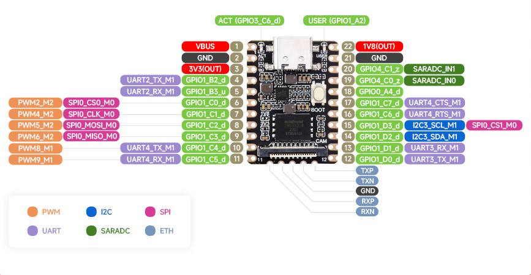

# 说明

本分支为个人修改版，原版代码请查看main分支。

原版说明如下：

- [README_CN.md]( OFFICAL_README_CN.md)
- [README.md]( OFFICAL_README.md)

官方WIKI：https://wiki.luckfox.com/zh/Luckfox-Pico/Luckfox-Pico-quick-start

## 目录

| 路径                         | 说明                                                     |
| ---------------------------- | -------------------------------------------------------- |
| [media/](media/)             | Rockchip Media库目录，所有与库相关的源代码存放至此目录。 |
| [project/app/](project/app/) | App目录，所有应用相关源代码存放至此目录。                |
| [sysdrv/](sysdrv/)           | 系统目录，包含uboot、linux kernel、rootfs的源代码。      |

对于Rockchip media库目录与App目录而言，当其下的目录包含Makefile时会自动进行构建，无需修改其它文件。因此，如要添加一个新的库或者应用，只需要在相应的目录下创建一个子目录并仿造其它库或者应用编写Makefile即可。

### Rockchip Media库目录

此目录包含多Rockchip媒体编解码、ISP等算法相关源代码。对于用户而言，需要先于APP编译的程序均可放置于此目录。

此目录使用make管理构建树，因此对于每一个库而言，都需要有一个自己的Makefile文件，并通过包含（include）[Makefile.param](media/Makefile.param)文件获取参数。

每个库的Makefile需要实现的目标如下：

- all:默认目标，构建库并将构建好的资源（如二进制可执行文件、二进制库、头文件及其它资源文件）复制到RK_MEDIA_OUTPUT变量所指目录。
- distclean:清理构建。
- clean:同distclean。

### App目录

此目录包含App应用源代码。对于用户而言，所有应用相关源代码存放至此目录。

此目录使用make管理构建树，因此对于每一个App而言，都需要有一个自己的Makefile文件，并通过包含（include）[Makefile.param](project/app/Makefile.param)文件获取参数。

每个App的Makefile需要实现的目标如下：

- all:默认目标，构建App并将构建好的资源（如二进制可执行文件、二进制库、头文件及其它资源文件）复制到RK_APP_OUTPUT变量所指目录。
- distclean:清理构建。
- clean:同distclean。
- info:显示App信息

App可使用RK_APP_MEDIA_INCLUDE_PATH变量（Rockchip Media库头文件变量）与RK_APP_MEDIA_LIBS_PATH变量（Rockchip Media库库目录变量）来链接Rockchip Media库目录中的库。

## 编译

简易编译步骤如下：

- 配置目标（需要支持的主板）：

  ```bash
  ./build.sh lunch
  ```

  

- 编译：

  ```bash
  ./build.sh
  ```


编译过程中缺少什么就安装什么。

编译完成后镜像文件所在目录为output/image,可使用SocToolKit工具打开此目录进行烧录。

# 开发板

本仓库主要支持由[微雪电子](https://www.waveshare.net/)(代理[Luckfox](https://www.luckfox.com))出品的luckfox-pico开发板,也可用于其它RV1103/RV1106主控的固件开发（需自行适配）。

主要支持的开发板如下：

- Luckfox Pico Mini A
- Luckfox Pico Mini B
- LuckFox Pico
- LuckFox Pico Plus
- LuckFox Pico Pro/Max

## Luckfox Pico Mini A

### 硬件

Luckfox Pico Mini A是由[微雪电子](https://www.waveshare.net/)(代理[Luckfox](https://www.luckfox.com))出品的RV1103开发板，其具有64M RAM。采用SD卡启动。



### 固件

本仓库支持Luckfox Pico Mini A的板级配置如下：

-  BoardConfig-EMMC-NONE-RV1103_Luckfox_Pico_Mini_A-IPC.mk


## Luckfox Pico Mini B

### 硬件

Luckfox Pico Mini B是由[微雪电子](https://www.waveshare.net/)(代理[Luckfox](https://www.luckfox.com))出品的RV1103开发板，其具有64M RAM及128M SPI-Nand。 


### 固件

本仓库支持Luckfox Pico Mini B的板级配置如下：

-  BoardConfig-SPI_NAND-NONE-RV1103_Luckfox_Pico_Mini_B-IPC.mk

## LuckFox Pico

### 硬件

Luckfox Pico是由[微雪电子](https://www.waveshare.net/)(代理[Luckfox](https://www.luckfox.com))出品的RV1103开发板，其具有64M RAM。采用SD卡启动。


### 固件

本仓库支持Luckfox Pico的板级配置如下：

-  BoardConfig-EMMC-NONE-RV1103_Luckfox_Pico-IPC.mk


## LuckFox Pico Plus

### 硬件

Luckfox Pico Plus是由[微雪电子](https://www.waveshare.net/)(代理[Luckfox](https://www.luckfox.com))出品的RV1103开发板，其具有64M RAM及128M SPI-Nand。 


### 固件

本仓库支持Luckfox Pico Plus的板级配置如下：

-  BoardConfig-SPI_NAND-NONE-RV1103_Luckfox_Pico_Plus-IPC.mk


## LuckFox Pico Pro/Max

### 硬件

Luckfox Pico Pro/Max是由[微雪电子](https://www.waveshare.net/)(代理[Luckfox](https://www.luckfox.com))出品的RV1106开发板，其具有256M SPI-Nand。

Luckfox Pico Pro具有128M RAM。Luckfox Pico Max具有256M RAM。


### 固件

本仓库支持Luckfox Pico Pro/Max的板级配置如下：

- BoardConfig-SPI_NAND-NONE-RV1106_Luckfox_Pico_Pro_Max-IPC.mk


# 外设

在本仓库中外设主要指开发板的外设接口或者外设设备。详细的教程请访问[官方wiki](https://wiki.luckfox.com/zh/Luckfox-Pico/Luckfox-Pico-GPIO)。

Luckfox提供的外设操作库（封装一些操作,也可使用脚本操作外设）目录：[media/luckfox/](media/luckfox/)。

## 固定外设

固定外设主要指开发板上未使用引脚引出的外设，如采用专用接口的外设。

在设计自己的PCB板时，应尽量避免改变固定外设的用途（在SDK开发过程中会参考固定外设的接口，厂家可能已经分配了用途。）。

### 按键

BOOT按键：用于进入maskrom模式。

RESET按键：用于复位。

### LED

通常用于指示运行状态。

### SD卡

通常用于接sd卡（或emmc）等存储设备。

理论上还可用于接sdio接口的外设设备（如wifi模块），需要自行适配驱动与设备树。

### CSI 摄像头

适配 SC3336 3MP Camera (A)  摄像头，这款摄像头采用思特威SC3336感光芯片，支持3百万像素。具备高灵敏度，高信噪比低照度的性能，能够呈现更加细腻、色彩更加逼真的夜视全彩成像，更好地适应环境光线变化。

### 以太网

用于连接以太网。

### SPI-NAND

SPI-NAND挂接在一个支持Quad-SPI的SPI接口，占用六个IO（不包括电源与地）。

### USB

默认情况下，USB工作在OTG模式，即RV1103/RV1106可作为Device设备，主要用于供电、固件烧录、USB调试（USB虚拟网卡、基于USB的adb等），也可作为Host设备（由USB的id引脚切换）。

理论上，USB口还可配置为Host模式或Device模式。

本人推崇使用usb作为外设扩展接口，其具有以下优点：

- 支持热插拔与子设备枚举，无需在设备树中配置所挂接的子设备。
- 可使用hub扩展较多接口。
- 支持USB的转换芯片较多。

## 非固定外设

固定外设主要指开发板上使用引脚引出的外设。通常指所焊接排针的引脚，此类外设通常可通过设备树配置修改。

### GPIO

通用输入/输出是最简单的接口。

在Linux可通过sysfs访问GPIO,路径为/sys/class/gpio。

注意：只能使用引脚未被配置为其它非GPIO功能的引脚，否则可能无效或出现冲突。

Luckfox提供的库：

| 名称        | 路径                                                         |
| ----------- | ------------------------------------------------------------ |
| 头文件      | [media/luckfox/include/luckfox_gpio.h](media/luckfox/include/luckfox_gpio.h) |
| C源代码库   | [media/luckfox/src/luckfox_gpio.c](media/luckfox/src/luckfox_gpio.c) |
| C源代码示例 | [media/luckfox/examples/luckfox_gpio_test.c](media/luckfox/examples/luckfox_gpio_test.c) |


### PWM

PWM，全称为脉冲宽度调制（Pulse Width Modulation），是一种通过控制信号的脉冲宽度来实现模拟信号输出的技术。

在Linux可通过sysfs访问PWM,路径为/sys/class/pwm。

Luckfox提供的库：

| 名称        | 路径                                                         |
| ----------- | ------------------------------------------------------------ |
| 头文件      | [media/luckfox/include/luckfox_pwm.h](media/luckfox/include/luckfox_pwm.h) |
| C源代码库   | [media/luckfox/src/luckfox_pwm.c](media/luckfox/src/luckfox_pwm.c) |
| C源代码示例 | [media/luckfox/examples/luckfox_pwm_test.c](media/luckfox/examples/luckfox_pwm_test.c) |


### UART

通用异步收发传输器是非常常用的接口，可用于外接各种模块（如各种AT模块）、进行通信等。UART可通过设备树配置以加载其它通过它外接的外设驱动。

在本仓库中可采用设备文件访问UART，设备路径为/dev/ttySn(其中n为串口号)。

Luckfox提供的库：

| 名称        | 路径                                                         |
| ----------- | ------------------------------------------------------------ |
| 头文件      | [media/luckfox/include/luckfox_uart.h](media/luckfox/include/luckfox_uart.h) |
| C源代码库   | [media/luckfox/src/luckfox_uart.c](media/luckfox/src/luckfox_uart.c) |
| C源代码示例 | [media/luckfox/examples/luckfox_uart_test.c](media/luckfox/examples/luckfox_uart_test.c) |


### ADC

模数转换器在Linux上属于IIO（Industrial I/O）子系统，可通过sysfs访问ADC，路径为/sys/bus/iio/devices/

Luckfox提供的库：

| 名称        | 路径                                                         |
| ----------- | ------------------------------------------------------------ |
| 头文件      | [media/luckfox/include/luckfox_adc.h](media/luckfox/include/luckfox_adc.h) |
| C源代码库   | [media/luckfox/src/luckfox_adc.c](media/luckfox/src/luckfox_adc.c) |
| C源代码示例 | [media/luckfox/examples/luckfox_adc_test.c](media/luckfox/examples/luckfox_adc_test.c) |


### I2C

I2C作为一种总线可挂接多个子设备(各种传感器、OLED显示屏等)，其可在设备树中配置以加载合适的驱动。

在Linux中通常可直接在用户空间访问I2C总线（已经通过设备树配置的子设备的地址无法再通过用户空间访问），具体访问方式如下：

-  sysfs接口：/sys/bus/i2c/devices
- 设备文件接口：在本仓库中路径为/dev/i2c-n(n为I2C总线编号)

在用户空间可通过以下工具测试I2C总线：

- i2cdetect
- i2cdump
- i2cget
- i2cset

Luckfox提供的库：

| 名称        | 路径                                                         |
| ----------- | ------------------------------------------------------------ |
| 头文件      | [media/luckfox/include/luckfox_i2c.h](media/luckfox/include/luckfox_i2c.h) |
| C源代码库   | [media/luckfox/src/luckfox_i2c.c](media/luckfox/src/luckfox_i2c.c) |
| C源代码示例 | [media/luckfox/examples/luckfox_i2c_test.c](media/luckfox/examples/luckfox_i2c_test.c) |


### SPI

SPI作为一种总线，可连接多种外设。与I2C不同，无论是否挂接有外设，SPI总线的功能必须在设备树中配置好，当无外设挂接时需要配置为spidev才可通过用户空间访问。

当配置好设备树后，可通过用户空间访问SPI总线，具体访问方式如下：

- sysfs接口：/sys/class/spi_master` 和 `/sys/bus/spi/devices
- 设备文件接口:/dev/spidevX.Y，其中X表示 SPI 总线编号，Y表示 SPI 设备编号(通常等效于CS片选的编号，如SPI0使用CS0的设备文件名为/dev/spidev0.0)。

Luckfox提供的库：

| 名称        | 路径                                                         |
| ----------- | ------------------------------------------------------------ |
| 头文件      | [media/luckfox/include/luckfox_spi.h](media/luckfox/include/luckfox_spi.h) |
| C源代码库   | [media/luckfox/src/luckfox_spi.c](media/luckfox/src/luckfox_spi.c) |
| C源代码示例 | [media/luckfox/examples/luckfox_spi_test.c](media/luckfox/examples/luckfox_spi_test.c) |


# 板级配置

板级配置的说明见官方原说明，配置所在目录为[project/cfg/BoardConfig_IPC/](project/cfg/BoardConfig_IPC/)。

本仓库采用make作为主要的构建工具，其配置通过Makefile变量进行配置。

现有如下配置文件：

- BoardConfig-EMMC-NONE-RV1103_Luckfox_Pico-IPC.mk:适用于Luckfox Pico开发板及其兼容开发板。  
- BoardConfig-SPI_NAND-NONE-RV1103_Luckfox_Pico_Plus-IPC.mk:适用于Luckfox Pico Plus开发板及其兼容开发板。  
- BoardConfig-SPI_NAND-NONE-RV1106_Luckfox_Pico_Max-IPC.mk:适用于Luckfox Pico Pro/Max开发板及其兼容开发板。
- BoardConfig-SPI_NAND-NONE-RV1103_Luckfox_Pico_Plus-HYH_Custom.mk:适用于Luckfox Pico Plus开发板及其兼容开发板。 个人修改版。

## 配置项

### RK_ARCH

RockChip架构，本仓库固定为arm。

### RK_CHIP

RockChip架构，本仓库固定为rv1106(无论是RV1103还是RV1106均使用rv1106作为代号)。

### RK_TOOLCHAIN_CROSS

RockChip交叉编译工具链，由于本仓库包含交叉编译工具链，故此为固定值(arm-rockchip830-linux-uclibcgnueabihf)。

### RK_BOOT_MEDIUM

RockChip启动介质，可选项为emmc/spi_nor/spi_nand。

Luckfox Pico根据配置的不同可选emmc与spi_nand。

### RK_UBOOT_DEFCONFIG

RockChip Uboot的默认Kconfig配置文件名。

Uboot源代码目录为[sysdrv/source/uboot/u-boot/](sysdrv/source/uboot/u-boot/)，Uboot的Kconfig默认配置目录为[sysdrv/source/uboot/u-boot/configs/](sysdrv/source/uboot/u-boot/configs/)。

### RK_UBOOT_DEFCONFIG_FRAGMENT

RockChip Uboot的默认Kconfig配置文件名(分片)，通常用于配置启动介质。

Uboot源代码目录为[sysdrv/source/uboot/u-boot/](sysdrv/source/uboot/u-boot/)，Uboot的Kconfig默认配置目录为[sysdrv/source/uboot/u-boot/configs/](sysdrv/source/uboot/u-boot/configs/)。

### RK_KERNEL_DEFCONFIG

RockChip Linux内核默认Kconfig配置文件名。

Linux源代码目录为[sysdrv/source/kernel/](sysdrv/source/kernel/)，本仓库默认Kconfig配置文件目录为[sysdrv/source/kernel/arch/arm/configs/](sysdrv/source/kernel/arch/arm/configs/)。

### RK_BUILDROOT_DEFCONFIG

buildroot的默认Kconfig配置文件名。

buildroot可作为构建基本rootfs文件系统(可添加一些受buildroot的软件包到rootfs)的工具,其官网为https://buildroot.org/。

相关文件见[sysdrv/tools/board/buildroot/](sysdrv/tools/board/buildroot/),一般情况下，此值不可变，也可使用buildroot官方的一些配置(即buildroot的configs目录原本就有的配置文件)。

如需定义新的配置文件，需修改[sysdrv/Makefile](sysdrv/Makefile)中buildroot构建目标中的命令,如复制自己的默认配置到buildroot的configs目录。

buildroot可用于编译依赖较多的软件包，当用户的App依赖较多的成熟软件库时，可尝试在buildroot的默认配置文件启用它们，而不是一个一个下载并添加到Rockchip Media库目录。

### RK_KERNEL_DTS

RockChip Linux内核的设备树文件名。Linux源代码目录为[sysdrv/source/kernel/](sysdrv/source/kernel/)，本仓库设备树目录为[sysdrv/source/kernel/arch/arm/boot/dts/](sysdrv/source/kernel/arch/arm/boot/dts/)。

### RK_MISC

RockChip杂项镜像。

### RK_CAMERA_SENSOR_IQFILES

RockChip摄像头传感器IO文件。

### RK_CAMERA_SENSOR_CAC_BIN

RockChip摄像头传感器CAC校准文件。

### RK_BOOTARGS_CMA_SIZE

RockChip CMA大小配置，注意：默认情况下用户空间不可使用CMA内存，CMA内存专用于内核空间，在本仓库主要用于摄像头等。

### RK_PARTITION_CMD_IN_ENV

RockChip 分区设置。分区设置存储在Env分区。

### RK_PARTITION_FS_TYPE_CFG

RockChip 文件系统设置。设置文件系统类型及挂载信息。

### RK_SQUASHFS_COMP

RockChip squashfs文件系统压缩设置。

### RK_UBIFS_COMP

RockChip ubifs文件系统压缩设置。

### RK_APP_TYPE

RockChip  APP类型。

APP类型的配置的使用可参见[project/app/rkipc/Makefile](project/app/rkipc/Makefile)。

### RK_PRE_BUILD_OEM_SCRIPT

构建OEM前脚本，见project/build.sh。

脚本目录同板级配置目录(即[project/cfg/BoardConfig_IPC](project/cfg/BoardConfig_IPC))

### RK_APP_IPCWEB_BACKEND

RockChip  APP IPC web后台。

APP IPC web后台配置的使用可参见[project/app/ipcweb/Makefile](project/app/ipcweb/Makefile)。

### RK_BUILD_APP_TO_OEM_PARTITION

RockChip  将APP安装至OEM分区

### RK_ENABLE_ROCKCHIP_TEST

RockChip rockchip_test(其源代码目录为[sysdrv/tools/board/rockchip_test/](sysdrv/tools/board/rockchip_test/))

## BoardConfig-SPI_NAND-NONE-RV1103_Luckfox_Pico_Plus-HYH_Custom.mk

本板级配置由BoardConfig-SPI_NAND-NONE-RV1103_Luckfox_Pico_Plus-IPC.mk修改而来，为符合本人习惯做了如下修改：

- 修改分区配置，将合并原rootfs、oem、userdata数据为一个分区,关闭oem单独分区。
- 不启用RK_ENABLE_ROCKCHIP_TEST

### 分区

Luckfox pico plus采用128M SPI-Nand作为系统存储，其分区布局如下：

| 起始地址 | 大小                 | 名称    | 说明                                                         |
| -------- | -------------------- | ------- | ------------------------------------------------------------ |
| 0x0      | 0x40000(256KBytes)   | env     | 环境变量分区。                                               |
| 0x40000  | 0x40000(256KBytes)   | idblock |                                                              |
| 0x80000  | 0x80000(512KBytes)   | u-boot  | U-Boot分区。                                                 |
| 0x100000 | 0xC00000(12MBytes)   | boot    | 启动分区，通常用于存储由Linux内核与设备树及其它资源（如LOGO）的U-Boot Fit镜像。 |
| 0xD00000 | 0x7000000(112MBytes) | rootfs  | 根文件系统。默认采用UBIFS。 UBI镜像参数:LEB size=0x1F000(126976),min./max. I/O unit sizes: 2048/2048,name=rootfs |

# 烧录

SocToolKit在[tools](tools)目录下。

根据所使用的操作系统选择使用linux还是windows目录。

注意：由于Linux下的工具未使用静态链接，可能存在glibc兼容问题。

简易烧录步骤如下：

- 打开SocToolKit，根据板子类型，选择芯片为RV1103或RV1106。
- 使用SocToolKit打开编译完成后的镜像目录。
- 按住BOOT按键（此时确保芯片未上电），使用USB连接PC机并上电。此步骤的主要目的为进入maskrom模式。
- 开始烧录等待写入完成。

# 调试

基于Linux的开发板调试方式多种多样，如串口调试、网络调试（ssh、基于TCP的adb等）、USB调试（基于USB的adb、使用USB虚拟网卡进行网络调试等）。

本人主要使用串口调试， 串口为UART2,115200 8N1。

注意：调试串口在Linux下的设备名为/dev/ttyFIQ0，而非/dev/ttyS2。


